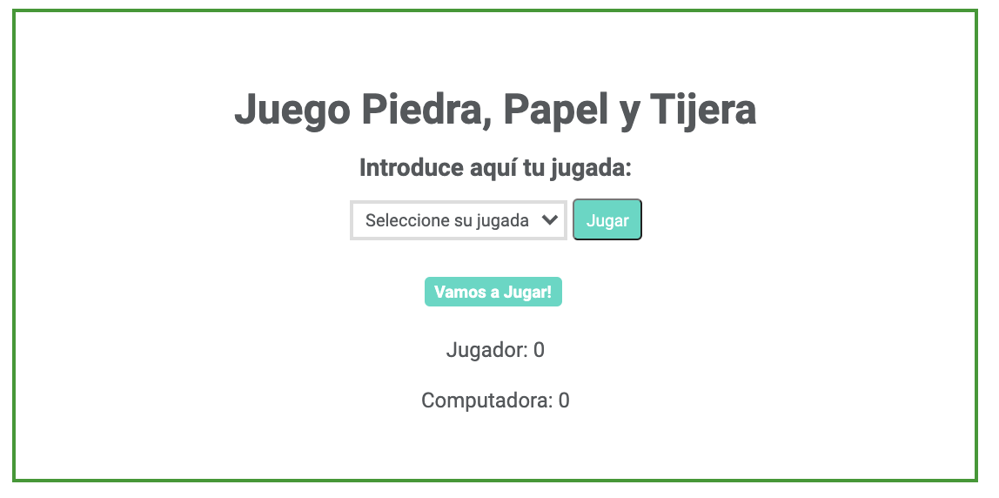

# Módulo 2: Ejercicio intermedio

El ejercicio consiste en desarrollar el juego "Piedra, Papel y Tijera". En el juego ambas jugadoras tienen que hacer una piedra, papel o tijeras. Solo tiene dos resultados posibles: un empate o una victoria para una jugadora y una derrota para la otra jugadora. Diseñaremos el juego usando JavaScript donde una jugadora jugará contra la computadora.


## Descripción

El programa genera un movimiento al azar entre papel, piedra y tijera (las indicaciones para generar el movimiento al azar están más adelante). Posteriormente la usuaria juega, el programa compara los movimientos y decide si la usuaria ha ganado, perdido o empatado contra el ordenador. También a su vez el programa va contabilizando el número de puntos del jugador y del ordenador. El juego se acaba cuando se realicen 10 movimientos.

## Indicaciones



- En la parte superior, la jugadora selecciona la jugada del desplegable. Las opciones son **Piedra, Papel y Tijera** y le da clic en el botón **Jugar**
- Debajo, en el próximo apartado aparecen los siguientes textos:
  - Al arrancar la página: **¡Vamos a Jugar!**.
  - Cuando la jugadora introduzca un movimiento que coincida con al movimiento aleatorio se muestra el mensaje: **Empate**.
  - Cuando la jugadora introduzca un movimiento que gane al movimiento aleatorio se muestra el mensaje: **¡Has Ganado!**.
  - Cuando la jugadora introduzca un movimiento que falle al movimiento aleatorio se muestra el mensaje: **¡Has perdido!**.

### Pasos para realizar el juego

Para realizar el juego tenemos que realizar las siguientes funcionalidades desde JavaScript:

1. Crear una maquetación mínima con el select, el botón y el espacio para el resultado.
2. Generar un número aleatorio entre 1 y 9 con la ayuda de [`Math.random`](https://developer.mozilla.org/en-US/docs/Web/JavaScript/Reference/Global_Objects/Math/random) y [`Math.ceil`](https://developer.mozilla.org/en-US/docs/Web/JavaScript/Reference/Global_Objects/Math/ceil). Puedes usar la siguiente función, copia estas 3 líneas de código en vuestro JS y **no las modifiquéis**:

```javascript
function getRandomNumber(max) {
  return Math.ceil(Math.random() * max);
}
```

3. Generar un movimiento aleatorio y para eso puedes seguir las siguientes indicaciones:

   - si el número aleatorio generado en el paso anterior es menor o igual que 3 el movimiento es **piedra**
   - si el número aleatorio generado es mayor o igual que 7 el movimiento es **papel**
   - y sino, el movimiento generado es **tijera**

4. Comparar el movimiento que la jugadora ha seleccionado con el movimiento que ha generado la computadora y pintar las pistas correspondientes en la pantalla.

## Bonus

Si te queda tiempo y quieres completar las funcionalidades del juego, puedes hacer lo siguiente:

- Saca tu lado creativo y maqueta y decora tu página con estilo.
- En la parte inferior debe aparecer los puntos de cada jugadora. Agrega el código necesario para contar los puntos del jugador y del ordenador.
- El juego finaliza cuando llega a 10 movimientos, agrega el código necesario para que se muestre un botón **Reiniciar Juego** que vuelva a iniciar el juego cuando se cumpla esta condición y desaparezca el botón de **Jugar**.
- Cuando le demos click a al botón **Reiniciar Juego** desaparece este botón, poner todos los contadores a cero y vuelve a aparecer el botón **Jugar**.
- Cuando finalice el juego, muestra quién ha ganado la partida: la computadora o la usuaria.

**¡A jugar!**
