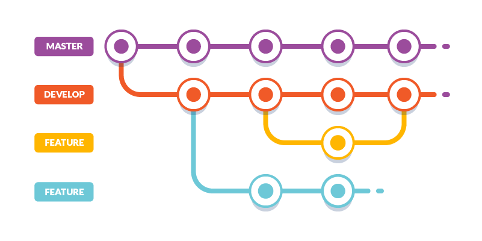

## Trabajo con ramas en Git

### ¿Qué es una rama?

Una rama (branch) es una copia paralela del proyecto donde puedes hacer cambios sin afectar al código principal. Permite trabajar en nuevas funcionalidades, correcciones o ideas sin miedo a romper nada.

---

### ¿Para qué sirven las ramas?

* Desarrollar funcionalidades sin afectar la versión estable
* Corregir errores de forma aislada
* Probar cambios que quizá no se integren al final
* Mantener múltiples versiones del proyecto (desarrollo, producción, histórico)
* Trabajar en paralelo en equipo

---

### Tipos de ramas

* **Permanentes:**

  * `master` o `main`: rama con la versión estable, lista para entregar o publicar.
  * `dev`: rama intermedia donde se integran nuevas funcionalidades antes de pasar a producción.
* **Puntuales:** ramas específicas para tareas concretas como `feature/login-form` o `fix/header-color`. Se crean desde `dev` y se fusionan ahí tras revisión.

---

### Flujo de trabajo

1. Se parte de la rama `dev`
2. Se crea una rama puntual desde `dev`
3. Se trabaja y hace `commit` en esa rama
4. Se sube la rama a GitHub (`git push origin nombre-rama`)
5. Se crea un merge fusionarla con `dev`
---

### Conflictos

* Ocurren cuando dos ramas modifican las mismas líneas
* Git no puede decidir cuál mantener, así que pide intervención manual
* Para resolverlos:

  1. Trae cambios de `dev` a tu rama puntual: `git merge dev`
  2. Resuelve los conflictos
  3. Haz `commit` y `push`
---

### Comandos clave para trabajar con ramas

| Acción                      | Comando                                      |
| --------------------------- | -------------------------------------------- |
| Ver ramas                   | `git branch`                                 |
| Crear y cambiar de rama     | `git switch -c nombre-de-la-rama`            |
| Cambiar de rama             | `git switch nombre-de-la-rama`               |
| Subir rama a GitHub         | `git push origin nombre-de-la-rama`  `git push --set-upstream origin feature/importjs`        |
| Ver ramas locales y remotas | `git branch -a`                              |
| Borrar rama local           | `git branch -d nombre-de-la-rama`            |
| Borrar rama remota          | `git push origin --delete nombre-de-la-rama` |
| Fusionar rama con `dev`     | `git switch dev`   `git merge nombre-de-la-rama`   `git push origin dev` |

